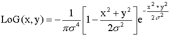
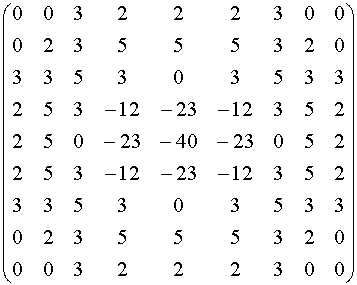

# CPEG585-ImageProcessing
Image Processing Assignments 1 and 2

See `ImageProcessing.pdf` for screen shots of the program

To create the multiple kernels requested in assignment 2 the `kerneldata` class was created.  This process was over engineered for educational purposes.  Base low pass filters were defined, permitting the kernel to convert itself into a High pass kernel (if defined as a low pass filter).

```c#
        public class kerneldata
        {
            private int _size;
            private double _param;

            public double[,] weights;
            public bool IsLowPass = true;
            public delegate double[,] CreateDelegate(int size = 3, double param = 0.0);

            \\Function to generate kernel
            public kerneldata(CreateDelegate delfunc,int size=3, double param=0.0)
            {
                CreateDelegate del = delfunc;
                weights = delfunc(size, param);
                _size = size;
                _param = param;
            }
            
            \\Convert to High Pass Filter
            public kerneldata ConvertToHP()  
            {
                kerneldata id = new kerneldata(GenerateIdentity,_size,_param){IsLowPass = false};
                kerneldata hp = new kerneldata(GenerateIdentity,_size,_param){IsLowPass = false};
                for(int row=0;row < _size;row++)
                for (int col = 0; col < _size; col++)
                    hp.weights[row, col] = (id.weights[row, col] - weights[row, col])*_size*_size;
                return hp;
            }
        }
```

A function to generate the kernel is created, for example here is a generator for Average Low Pass Filter.

```c#
        public static double[,] GenerateAverage(int size = 3, double param = 0)
        {
            double[,] result = new double[size, size];
            int center = (int)Math.Floor((double)size / 2);
            for (int row = 0; row < size; row++)
            {
                for (int col = 0; col < size; col++)
                    result[row, col] = (1.0 / (size*size));
            }

            return result;
        }
```

With this function the kernel can be created 
```c#
        public kerneldata Average = new kerneldata(GenerateAverage, 3, 1){IsLowPass = true};
```


Other Kernels requested utilize these kernels as part of their computation.

# Problems with Laplacian Kernel

The laplacian kernel has no method to autogenerate.  Instead I researched the Laplacian of the Gaussian.  Found these two articles:

[Laplacian of Gaussian Filter](https://academic.mu.edu/phys/matthysd/web226/Lab02.htm) and
[Spatial Filters - Laplacian/Laplacian Gaussian](https://homepages.inf.ed.ac.uk/rbf/HIPR2/log.htm)

Even though both of these had the same formula


 and same 9x9 discrete approximation
 
 
the formulas did not seem to work.

by changing the formula to:
\begin{align}
LoG(x,y) = -\frac{1}{2\pi\sigma^4}[1-\frac{x^2+y^2}{2\sigma^2}]\exp-\frac{x^2+y^2}{2\sigma^2
\end{align}

in this [article](https://www.codeproject.com/Questions/70003/Laplacian-of-Gaussian) the last solution talks


